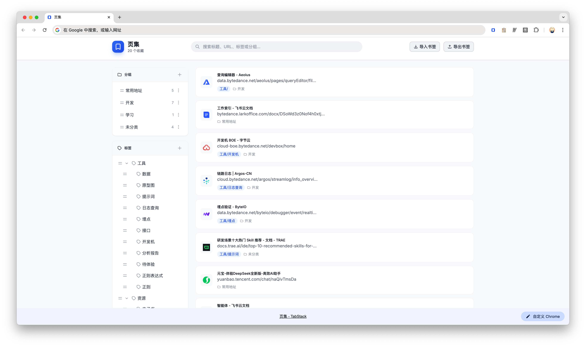
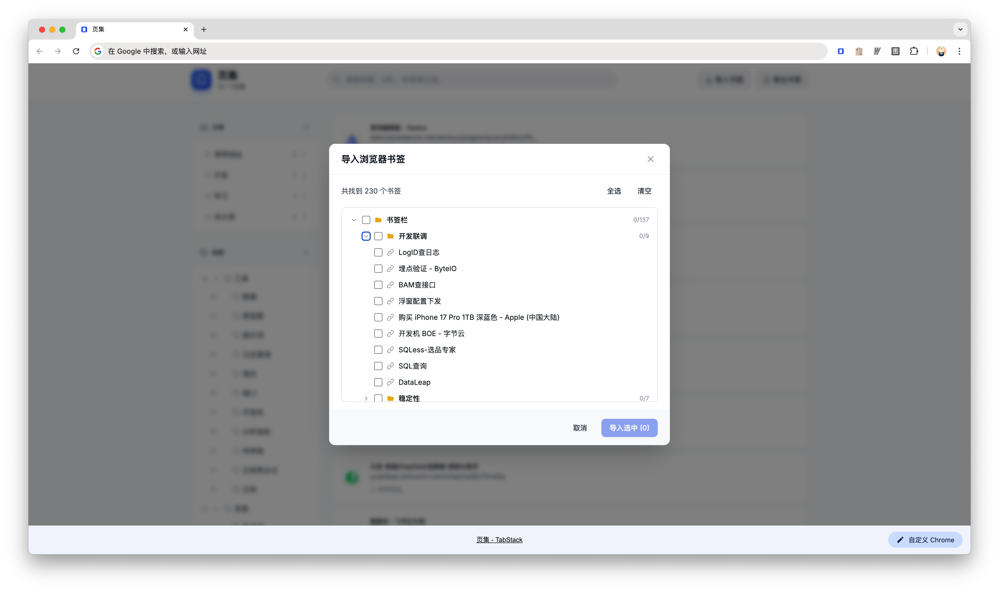
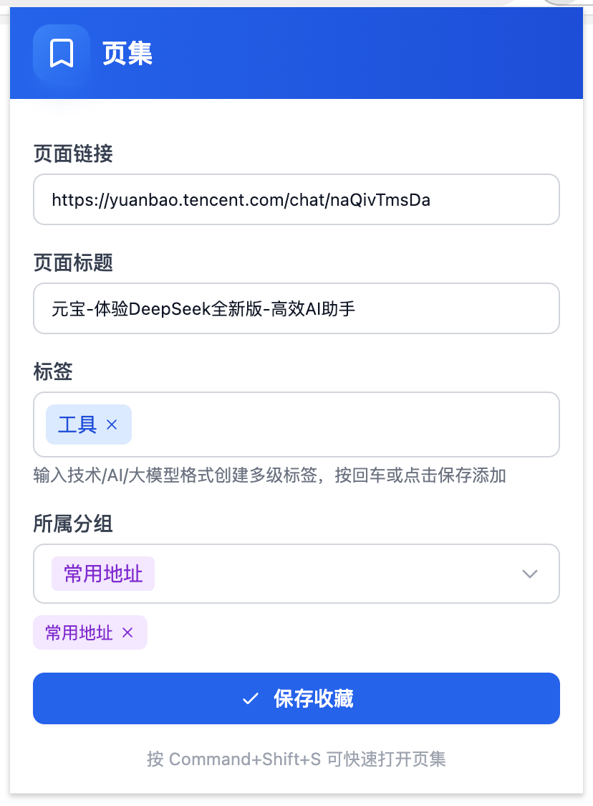

# 页集 (TabStack)

> 页集在手，分组打开不用愁。轻量级网页收藏与管理工具，支持分组一键打开和多级标签管理

## 功能特性

- 📁 **分组管理**：将网页按分组整理，支持一键打开整个分组
- 🏷️ **多级标签**：使用 `/` 分隔符创建多级标签，灵活分类
- 🔍 **快速搜索**：支持按标题、URL、标签和分组搜索
- ⚡ **快捷键**：使用 `Ctrl+Shift+S` (Windows) 或 `Command+Shift+S` (Mac) 快速打开收藏面板
- 📤 **导入导出**：支持从浏览器书签导入和导出到浏览器书签
- 🎯 **右键菜单**：右键点击页面可直接收藏到页集

## 安装说明

### 开发者安装

1. **克隆项目**
   ```bash
   git clone <repository-url>
   cd chrome-extension-page-management
   ```

2. **安装依赖**
   ```bash
   pnpm install
   ```

3. **构建项目**
   ```bash
   pnpm build
   ```

4. **加载到 Chrome**
   - 打开 Chrome 浏览器，访问 `chrome://extensions/`
   - 开启右上角的「开发者模式」
   - 点击「加载已解压的扩展程序」
   - 选择项目中的 `dist` 目录

### 开发模式

```bash
pnpm dev
```

开发模式下会自动打开浏览器并加载扩展（注意：开发模式可能需要手动在 `chrome://extensions/` 中重新加载）

## 界面预览





## 典型使用说明

### 1. 收藏页面

- **方式一**：点击浏览器工具栏的页集图标，填写信息后保存
- **方式二**：在网页上右键，选择「收藏到页集」
- **方式三**：使用快捷键 `Ctrl+Shift+S` (Windows) 或 `Command+Shift+S` (Mac)


### 2. 管理分组

- 打开新标签页查看页集主界面
- 在左侧分组列表点击「+」创建新分组
- 拖拽分组可调整排序
- 点击分组可筛选该分组下的页面
- 选择分组后点击「一键打开分组」可打开该分组下的所有页面

### 3. 使用标签

- 收藏页面时可添加多个标签
- 使用 `/` 分隔符创建多级标签，例如：`技术/AI/大模型`
- 在左侧标签树中点击标签可筛选相关页面
- 支持标签编辑和删除

### 4. 搜索和筛选

- 在顶部搜索框输入关键词，可搜索标题、URL、标签和分组
- 结合分组和标签进行多重筛选
- 点击「清除筛选」重置所有筛选条件

### 5. 导入和导出

- **导入**：点击「导入书签」从浏览器书签导入
- **导出**：点击「导出书签」将页集数据导出到浏览器书签

### 6. 编辑和删除

- 点击页面卡片上的编辑图标可修改页面信息
- 点击删除图标可删除页面（确认后不可恢复）
- 在分组菜单中可编辑、删除或置顶分组

## 技术栈

- **React 18** - UI 框架
- **TypeScript** - 类型安全
- **Tailwind CSS** - 样式框架
- **NextUI** - UI 组件库
- **Rsbuild** - 构建工具
- **Chrome Extensions API** - 浏览器扩展 API

## 项目结构

```
src/
├── manifest.json          # 扩展配置文件
├── background.ts          # 后台服务脚本
├── popup.tsx              # 弹出窗口组件
├── newtab.tsx             # 新标签页主界面
├── src/
│   ├── components/        # React 组件
│   ├── utils/             # 工具函数
│   ├── storage.ts         # 存储管理
│   └── types.ts           # TypeScript 类型定义
└── icons/                 # 图标资源
```

## 许可证

MIT License
